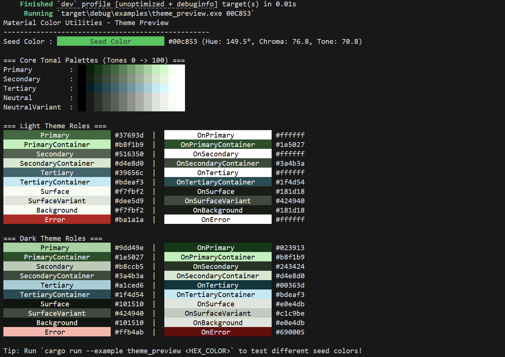

# material-color-utilities-rust

Google [Material Color Utilities](https://github.com/material-foundation/material-color-utilities) 的纯 Rust 实现，用于 Material Design 3 (M3) 动态色彩系统。

[English](README.md) | [简体中文](README_ZH.md)

## 特性

- **零运行时依赖**：仅基于 Rust 标准库实现，无外部第三方依赖。
- **严格数值对齐**：完整移植自 Google 官方 C++ 实现，常量、算法和边界处理与原版严格一致。
- **底层色彩科学**：完整实现 CAM16 色彩外观模型与 HCT (色相、彩度、明度) 求解器。
- **Material 3 动态配色**：
  - 支持 9 种标准预设方案（`TonalSpot`、`Vibrant`、`Expressive`、`Fidelity`、`Content`、`Monochrome`、`Neutral`、`Rainbow`、`FruitSalad`）。
  - `MaterialDynamicColors` 包含 54 个官方系统角色颜色。
  - 支持对比度自适应曲线与色调差值约束。
- **图像量化与取色**：内置 Wu、WSMeans 和 Celebi 量化器，以及 M3 主题评分筛选算法。
- **易于集成**：提供便捷的 ARGB / RGBA 转换，无缝对接 SlintUI 等图形界面框架。

## 快速上手

```rust
use material_color_utilities::{DynamicScheme, Hct, rgba_from_argb};

fn main() {
    // 1. 创建种子颜色
    let seed = Hct::from_int(0xff42_85f4); // Google 蓝

    // 2. 生成浅色和深色 Material 3 配色方案
    let light = DynamicScheme::tonal_spot(seed, false, 0.0);
    let dark = DynamicScheme::tonal_spot(seed, true, 0.0);

    // 3. 读取动态角色颜色
    println!("浅色 Primary: #{:06x}", light.primary() & 0x00ff_ffff);
    println!("深色 Primary: #{:06x}", dark.primary() & 0x00ff_ffff);

    // 4. 转换为 RGBA 分量以便渲染
    let (r, g, b, a) = rgba_from_argb(light.primary());
    println!("RGBA: ({r}, {g}, {b}, {a})");
}
```

## 终端预览



在终端中直接查看 24-bit 真彩色调色板与系统角色预览：

```bash
cargo run --example theme_preview [16进制颜色]
```

## 测试与静态检查

```bash
cargo test
cargo clippy --all-targets -- -D warnings
```

## 开源协议

Copyright 2026 SaKongA.

本项目采用 Apache-2.0 协议。
